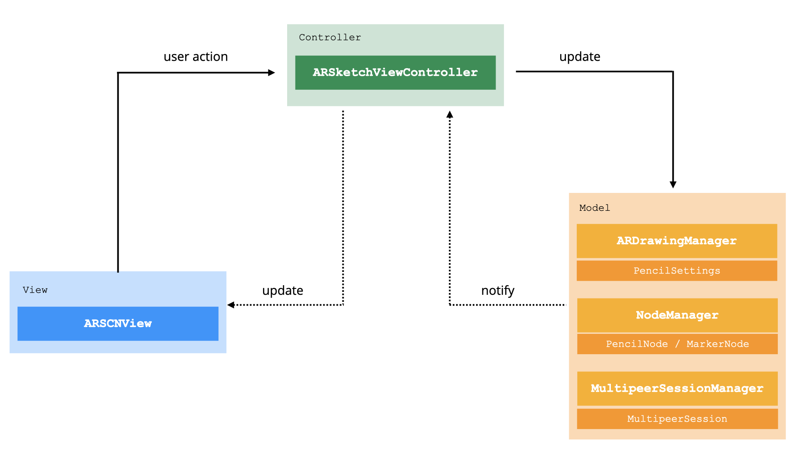

# AR-Sktech

This is the project for my Bachelor's thesis "Benutzerzentrierte Entwicklung eines kollaborativen AR-Sketching Tools" at the University of Applied Sciences Berlin.
It is a multiuser collaborative augmented reality sketching application using SceneKit and ARKit in combination with the MultipeerConnectivity framework.  

## Release Notes
The application was developed and tested using:  
- Xcode Version 11.5 ([`Download`][7])
- Apple's operating system iOS 13.7
- on iPhone 11 Pro, iPhone X, iPhone 6S.

For impressions of how this application works see the video files here:  [`HTW Berlin Cloud `][4].

&NewLine;
&NewLine;

## Overview

The application is structured according to the Model-View-Controller Pattern (MVC) as shown in the image below. For more information see: [`Apple Developer Documentation for MVC`][3].  
&NewLine;

The ARSketchViewController is the main class controlling all interactions between the view and the user such as the drawing mechanism, activating multipeer connection and the rendering of nodes in the scene. It interacts with the Manager classes (ARDrawingManager, CustomNodeManager, MultipeerSessionManager) in order to update the different models.  



*Source: Author's illustration adopted from [`Apple Developer Documentation for MVC`][3], Figure 7-2*

&NewLine;
# (View-)Controllers
&NewLine;

## ARSketchViewController

The ARSketchViewController implements several protocols and delegates and is therefore divided into multiple files (see: 1-7) in order to keep the application code in a way that is easy to overview:

### 1. ARSketchViewController

The [ARSketchViewController](x-source-tag://ARSketchViewController) contains all IB-Outlets from the View and additional variables.  
It manages the Lifecycle and any updates on the view, such as the [IB-Actions](x-source-tag://IBActions) and handling the rendered nodes in the scene via [ARSceneNodeManagerDelegate](x-source-tag://ARSceneNodeManagerDelegate) .

&NewLine;
### 2. ARSketchViewController+ARSessionDelegate:

The [ARSessionDelegate](x-source-tag://ARSessionDelegate) handles the creation of custom anchors.  
It creates new [CustomLineAnchor](x-source-tag://CustomLineAnchor) objects with [addCustomAnchor()](x-source-tag://addCustomAnchor) when the user is currently drawing.

&NewLine;
### 3. ARSketchViewController+ARSceneViewDelegate

The [ARSCNViewDelegate](x-source-tag://ARSCNViewDelegate) handles the creation of PencilNode or MarkerNode objects within the rendering method.  
For more information see: [`ARSCNViewDelegate`][6].  
Whenever a new [CustomLineAnchor](x-source-tag://CustomLineAnchor) object has been created the rendering method checks the `anchor.name` property (which is the owner's id).  
If the property matches the current user-id, it creates a 'normal' node, otherwise it creates a 'guest' node, for example when the user is connected to
a peer and they both share a world map.  

&NewLine;
### 4. ARSketchViewController+ARSessionObserver:

The [ARSessionObserver](x-source-tag://ARSessionObserver) checks the worldMappingStatus and depending on that enables or disables the collaboration mode.  
It also contains the methods, that handle sharing user's world map with [shareSession()](x-source-tag://ShareSession) and receiving data from other peers within the peer-to-peer connection with [receivedData(_ data: Data, from peer: MCPeerID)](x-source-tag://ReceiveData).

&NewLine;
### 5. ARSketchViewController+Gestures:

The [Gestures](x-source-tag://TouchGestures) extension handles all touch gestures such as:  

- pan for [drawing](x-source-tag://Draw)
- tap for [delete](x-source-tag://Delete)
- pinch for [scaling](x-source-tag://Scale)
- rotate for [rotating](x-source-tag://Rotate)
- long press for [moving](x-source-tag://Move)

&NewLine;
### 6. ARSketchViewController+CoachingOverlay:

The [CoachingOverlay](x-source-tag://ARCoachingOverlayView) contains all methods responsible for showing and hiding the ARCoachingOverlayView.
Whenever the tracking conditions are not optimal, it shows instructions to the user that help improving the tracking quality. For more information see: [`ARCoachingOverlayView`][1].  

&NewLine;
### 7. ARSketchViewController+RadioButtonDelegate:

Lastly, the [RadioButtonDelegate](x-source-tag://RadioButtonDelegate) handles the selection of any item in the bottom tool bar and updates the view accordingly.  


&NewLine;
# (Model-)Controllers
## ARDrawingManager

The [ARDrawingManager](x-source-tag://ARDrawingManager) keeps track of the pencil settings model and any other variables and constants that are related to the drawing functionality.
It is acting as a helper between the ARSketchViewController and the PencilSettings.

&NewLine;
## CustomNodeManager

The [CustomNodeManager](x-source-tag://CustomNodeManager) keeps track of all [CustomNode](x-source-tag://CustomNodeProtocol) objects in the AR scene including the nodes of the paired device within the peer-to-peer connection.   
It is acting as a helper between the ARSketchViewController and the CustomNode objects in the scene.

&NewLine;
## MultipeerSessionManager

The [MultipeerSessionManager](x-source-tag://MultipeerSessionManager) is an adapted class of MultipeerSession taken from the apple developer sample project '[`Creating a Multiuser AR Experience`][2]'. It manages the communication between devices via the MultipeerConnectivity framework. It is acting as a helper between the ARSketchViewController and the MultipeerSession.  


&NewLine;
&NewLine;

# Models

&NewLine;
## CustomLineAnchor  

The [CustomLineAnchor](x-source-tag://CustomLineAnchor) object  inherits from ARAnchor and contains source and destination point of the next line segment as well as pencil settings and owner id. Additionally it implements methods for deserialization and serialization, which is neccessary in order to send CustomLineAnchor objects between peers via MultipeerSession.

&NewLine;
## Point  

The [Point](x-source-tag://Point) object contains all information needed for a 3D point and methods for deserialization and serialization as well since CustomLineAnchor contains Point objects (source point and destination point).  

&NewLine;
## PencilNode  

[PencilNode](x-source-tag://PencilNode) objects inherit from SCNNode and conform to the CustomNodeProtocol.
PencilNode objects represent the standard pencil type and therefore contain all relevant information about the geometry and materials to be rendered such as:  

- vertices, centerpoints, indices
- color and stroke width
- owner id

The function addVertices updates the selected node with new triangles according to the destination point, cameraViewVector and the selected color and stroke width:   
``` swift
func addVertices(for point: SCNVector3, cameraViewVector: SCNVector3, color: UIColor, strokeWidth: Float) {
        ...
        let dir = (point - start).normalized()
        let orthoVec = dir.cross(vector: cameraViewVector) * strokeWidth / 2
        var newVertices: [SCNVector3] = []

        if centerPoints.count == 1 {

            newVertices = [
                start + orthoVec, // First
                start - orthoVec, // Second
                point + orthoVec, // Third

                start - orthoVec, // Second
                point + orthoVec, // Third
                point - orthoVec  // Fourth
            ]

        } else if centerPoints.count > 1 && vertices.count > 2 {

            newVertices = [
                vertices[vertices.count - 2],
                vertices[vertices.count - 1],
                point + orthoVec,
                vertices[vertices.count - 1],
                point + orthoVec,
                point - orthoVec
            ]
        }

        centerPoints.append(point)
        updateVertices(with: newVertices)
        updateGeometry()
        updatePivot()
    }
```
[View in Source](x-source-tag://AddVertices)

&NewLine;
## MarkerNode  

[MarkerNode](x-source-tag://MarkerNode) objects inherit from SCNNode and conform to the CustomNodeProtocol.  
MarkerNode objects represent the marker type and therefore contain all relevant information about the geometry and materials to be rendered such as:  

- vertices, centerpoints, indices
- color and stroke width
- owner id  

The function addVertices updates the selected node with new triangles according to the destination point, the selected color and stroke width. In comparison to [PencilNode](x-source-tag://PencilNode), this implementation creates a marker shaped node by shifting the top vertices of start and end point to the left and the bottom vertices of start and endpoint to the right by half of the value of the stroke width.
The shape of these nodes generally points to the upward direction of the AR scene:  

``` swift
func addVertices(for point: SCNVector3, cameraViewVector: SCNVector3, color: UIColor, strokeWidth: Float) {
        ...

        let width = strokeWidth / 2
        guard let start = centerPoints.last else { return }

        let newVertices = [
            SCNVector3(start.x - width/2 , start.y + width, start.z),
            SCNVector3(start.x + width/2 , start.y - width, start.z),
            SCNVector3(point.x - width/2 , point.y + width, point.z),

            SCNVector3(start.x + width/2, start.y - width, start.z),
            SCNVector3(point.x - width/2, point.y + width, point.z),
            SCNVector3(point.x + width/2, point.y - width, point.z)
        ]

        centerPoints.append(point)
        updateVertices(with: newVertices)
        updateGeometry()
        updatePivot()
    }
```
[View in Source](x-source-tag://AddVerticesM)  


&NewLine;
## PencilSettings  

The [PencilSettings](x-source-tag://PencilSettings) struct defines all information needed to create a CustomNode such as:  
- pencilType
- strokeWidthSettings
- strokeColor

&NewLine;
&NewLine;
&NewLine;
# Views

&NewLine;
## ColorPickerView  

The [ColorPickerView](x-source-tag://ColorPickerView) represents the color overlay for selecting different colors. Different colors are stored in [CustomColorPickerCell](x-source-tag://CustomColorPickerCell) objects via a [`UICollectionView`][5].

&NewLine;  
## StrokeWidthPicker  

The [StrokeWidthPicker](x-source-tag://StrokeWidthPicker) represents the overlay for selecting different stroke widths.

&NewLine;  
## ToolPickerView  

The [ToolPickerView](x-source-tag://ToolPickerView) represents the overlay for selecting different tools. The [ToolButton](x-source-tag://ToolButton) objects represent the UI elements for different functions such as:
 - marker
 - pencil
 - erasor
 - transform  

 &NewLine;  
 ## MessageLabel

 The [MessageLabel](x-source-tag://MessageLabel) represents the window displaying any additional information on the screen such as user instructions when the transform button is selected.

 


[1]:https://developer.apple.com/documentation/arkit/arcoachingoverlayview
[2]:https://developer.apple.com/documentation/arkit/creating_a_multiuser_ar_experience
[3]:https://developer.apple.com/library/archive/documentation/General/Conceptual/CocoaEncyclopedia/Model-View-Controller/Model-View-Controller.html
[4]:https://cloud.htw-berlin.de/apps/files/?dir=/Bachelor_AR-Sketching-Tool&fileid=120811853
[5]:https://developer.apple.com/documentation/uikit/uicollectionview
[6]:https://developer.apple.com/documentation/arkit/arscnviewdelegate
[7]:[https://xcodereleases.com/]
